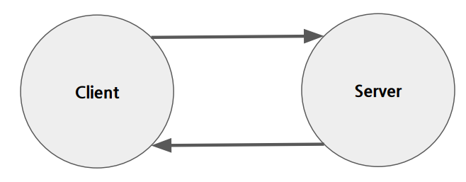
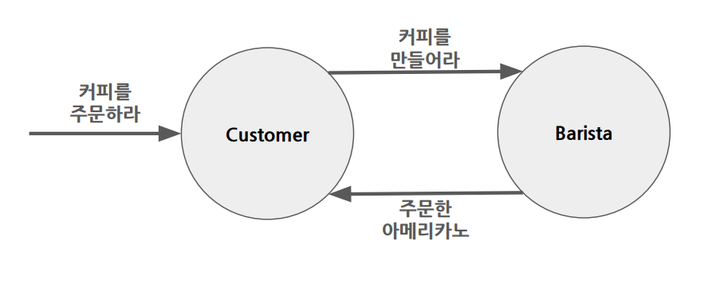
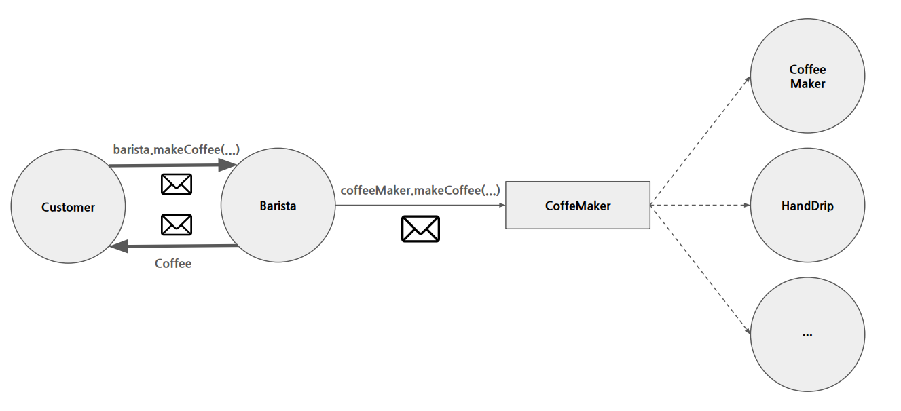

#### 변화에 적응하는 소프트웨어의 특징은 무엇일까?
- 유연성
- 확장성
- 유지 보수성

이 3가지가 충족이 된다면 변화에 적응하는 SW 제품 입니다.

## 의존?
> 어떠한 일을 자신의 힘으로 하지 못하고 다른 어떤 것의 도움을 받아 의지하는 것


### 의존은 코드에서는 어떻게 표현될까?
- 객체 참조에 의한 관계
- 메서드 리턴타입이나 파라미터로서의 의존관계
- 상속에 의한 의존 관계
- 구현에 의하 의존 관계

등 여러가지가 있을 것 입니다.   

#### "강의에서 설명은 Kotilin으로 진행하였지만, 저는 Java로 직접 해석해서 공부하였습니다"

### 1) 객체 참조에 의한 연관 관계
``` java
class ClassA {
    private ClassB b = new ClassB();

    public void someMethod() {
        b.someMethod();
    }
}

class ClassB {
    public void someMethod() {
    }
}
```
위 처럼 Class A는 ClassB의 메소드에 의존하여 사용을 합니다.

### 2) 메서드 리턴 타입이나 파라미터로서의 의존관계
```java
class ClassA {
    public ClassC methodB(ClassB b) {
        return b.someMethod();
    }
}

class ClassB {
    public ClassC someMethod() {
        return new ClassC();
    }
}

class ClassC {
}
```
위 코드는 ClassC 객체를 B가 참조하고, B객체를 A객체에서 파라미터로 참조하면서 의존하는 관계이다.

### 3) 상속에 의한 의존 관계
```java
abstract class SuperClass {
    public abstract void functionInSuper();
}

class SubClass extends SuperClass {
    @Override
    public void functionInSuper() {
        System.out.println("SuperClass의 functionInSuper() 메소드입니다.");
    }
}
```
위 코드는 추상 클래스인 SuperClass 를 SubClass에서 상속받아서 의존하는 관계를 설명하는 코드입니다. 

### 4) 구현에 의한 의존 관계
```java
public interface InterfaceA {
	void functionInterfaceA();
}

class interfaceB implements InterfaceA {
	@Override
    void functionInterface() {
		//로직
    }
}
```
위 코드는 interface 선언을 통하여, 메소드를 직접 구현을 하여 의존하는 관계를 설명하는 코드 입니다.


### 그렇다면 의존이 가지는 진짜 의미는 무엇일까?
바로 <b>변경 전파 가능성</b><br>
필요한 의존성만 유지하고, 의존성은 최소화 하는게 좋다

---

## 절차지향 과 객체지향의 차이란?
### 절차지향?
- 프로시저에 중점을 둔다
- 프로그램은 일련의 절차적 단계를 구성되고, 데이터와 프로시저가 별도로 존재한다.

### 객체지향?
- 데이터와 기능을 하나의 객체로 묶는다.

객체지향 설계를 통해서 의존을 다룰 수 있다.<br>
=> 변경이 전파되는 것을 제한하도록 돕는다.<br>

🖐 그렇다면 어떻게 제한하도록 하는 걸까?<br>
=> 객체는 자체 상태와 행동을 갖기 때문에 가능하다

🖐 그렇다면 왜 가능한걸까? <br>
=> 하나의 객체(내부)가 변경되더라도, 외부에서는 알 수 없다 -> <b>캡슐화</b> 
- 코드의 재사용성 증가
- 개발의 효율성 증가
- 보안성 향상

이런 장점들이 있습니다. 

### 그러면 객체지향 설계에서 의존을 다루는 핵심은 무엇일까요?
- Message Passing
- Encapsulation
- Dynamic Binding

#### Message Passing
클라이언트는 요청만 하면, 서버는 내부적으로 무얼 하는지 알수 없다. 하지만 응답은 온다.


클라이언트는 자신이 원하는 목적을 달성할 수 있는 서버으 API는 알고 있다.<br>
서버는 API를 통해 받은 요청을 서버가 할 수 있는 방법으로 처리한다<br>

한번 예시를 들어보겠습니다.

고객이 원하는 것 : 커피를 주문한다
고객이 커피를 주문 하는 방법 : 바리스타에게 커피 만들기 요청하기<br>
고객이 원하는 결과 : 커피


위 사진에서 고객(=클라이언트)가 Http 요청을 보내면, 서버(=바리스타)는 응답을 해줘야한다. <br>

위 과정을 실제 코드로 만들어보겠습니다.
```java
// 커피를 만드는 바리스타를 나타내는 클래스
class Customer {
	public void order(Barista barista, String coffeeType) {
		barista.makeCoffee(coffeeType);
	}

}
class Barista {
	public void makeCoffee(String coffeeType) {
		System.out.println(coffeeType + "를 만드는 중입니다.");
	}

}
public class CoffeeShop {
	public static void main(String[] args) {

		Customer customer = new Customer();
		Barista barista = new Barista();

		customer.order(barista, "아메리카노");

	}

}


```
> 결과 : 아메리카노를 만드는 중입니다.

위 코드 실행 결과는 '아메리카노를 만드는 중입니다' 라는 결과를 도출합니다.<br>
위 코드의 동작 원리 사진 입니다. 


즉 전달하는 메시지는 makeCoffee -> 메소드에 파라미터로부터 값을 도출 받아 메시지를 전달합니다.<br>

메시지를 전달하는 바리스타는 
- 어떤 API를 호출하면 되는지만 알면됩니다.

메세지를 수신하는 고객은
- 내가 주문한 것에 대한 것만return을 받으면 됩니다.

즉, 위에서 말하는 객체지향 핵심 Message Passing은,<br>
객체가 메시지를 전달 받으면, 메시지에 맞는 행동을 취하고 <br>
메시지에 맞는 응답만 도출하면 된다는 뜻 입니다.

---
#### Encapsulation
캡슐화 : 객체의 내부 상태와 동작을 외부로부터 숨기는 방법 입니다.<br>

🖐 그러면 외부로 부터 숨긴다는 것은 무엇을 의미할까요?
- 결합도를 낮추는 것을 의미합니다 -> 변경에 용이하다.

캡술화가 왜 결합도랑 변경과 관계가있는지에 대한 의문이 생길 것입니다.<br>
코드를 통해서 직접 보겠습니다

> 높은 결합도 코드
```java
class HighCouplingClass {
	private int data = 10;

	public int getData() {
		return data;
	}

	public void setData(int data) {
		this.data = data;
	}
}

class AnotherHighCouplingClass {
	private int data;

	public AnotherHighCouplingClass(HighCouplingClass highCouplingClass) {
		this.data = highCouplingClass.getData();
	}

	public int getData() {
		return data;
	}

	public void setData(int data) {
		this.data = data;
	}
}

public class Main1 {
	public static void main(String[] args) {
		HighCouplingClass highCouplingInstance = new HighCouplingClass();
		AnotherHighCouplingClass anotherHighCouplingInstance =  new AnotherHighCouplingClass(highCouplingInstance);
		System.out.println(anotherHighCouplingInstance.getData());
	}
}

```
> 결과값 : 10

위 코드는 높은 결합도를 가진 코드 입니다. 
왜 높은 결합도를 가진 코드냐면, HighCouplingClass 와 AnotherHighCouplingClass간에 <br>
강한 의존성이 있어서 입니다. <br>

AnotherHighCouplingClass 의 생성자에서 HighCouplingClass의 인스턴스를 받아와서 사용한다. <br>
이 뜻은 HighCouplingClass 에서 내부가 변경된다면 AnotherHighCouplingClass또한 수정을 해야한다는 뜻 입니다. 

> 낮은 결합도 코드
```java
public class LowCoupling {
	private String data = "10";
	public String getData() {
		return data;
	}
	public void setData(String data) {
		this.data = data;
	}
}

public class AnotherLowCoupling {
	private String data;
	public AnotherLowCoupling(String data) {
		this.data = data;
	}
	public String getData() {
		return data;
	}
	public void setData(String data) {
		this.data = data;
	}
}

public class LowCouplingMain {
	public static void main(String[] args) {
		LowCoupling lowCouplingInstance = new LowCoupling();
		AnotherLowCoupling anotherLowCouplingInstance = new AnotherLowCoupling(lowCouplingInstance.getData());

		System.out.println(anotherLowCouplingInstance.getData());
	}
}
```
위 코드는 결합도가 낮습니다 이유는, LowCoupling 클래스가 변경이 되어도 <br>
AnotherLowCoupling 클래스는 변경이 되지 않는다. <br>
그 이유는 두 클래스들은 생성자를 통해 데이터를 주고 받고 있습니다<br>
그 뜻은 한 LowCoupling 클래스의 필드가 변경이 되어도, AnotherLowCoupling클래스는<br>
생성자로 주입을 받았기 떄문에 직접적인 수정이 없어도 사용할 수 있습니다. 

##### 그러면 위 과정을(=캡슐화)를 통해서 얻는 장점은 무엇이 있을까요?
- 결합도를 낮춘다 -> 변경에 용이함
- 자율적인 객체 -> 소통은 인터페이스로, 구현은 내 마음대로 바꿀 수 있다. 


다음 새로운 예시에 대해서 알아보겠습니다.
```java
public class Car {
	private int speed;
	private int fuelLevel;
	
	void accelerate() {
		speed +=1;
	}
	void brake() {
		speed = -1;
	}
	void turnLeft() {
		System.out.println("좌회전 합니다.");
	}
	void turnRight() {
		System.out.println("우회전 합니다.");
	}
}

```
- Car 객체는, 직접접근이 불가능하고, 메소드를 통해서 접근이 가능하다
- 차가 브레이크를 밣을 때마다 로그를 남겨야 한다는 요구사항이 들어오면
  - Car 내부에 로깅을 할 수 있도록 수정을 하면 된다.
- 내부는 변경되어도 메소드는 변경되지 않는다.

이 점을 코드를 보고 이해 할 수 있어야합니다. 

즉 동적바인딩, 다형성 개념에 대하여 알고 있어야 합니다.

#### 동적바인딩
- 프로그램이 실행 중(=런타임 시점)에 메서드나 참조변수, 실제 객체타입을 확인하여 함수를 호출하는 것

#### 다형성
- 하나의 참조 변수로 여러 개의 객체를 참조할 수 있는 특성

여기서 말하는 참조 변수는 객체를 가리킵니다.
객체지향에서 다형성을 해석하면, 다른 객체에게 보내는 메세지가 실제로 어떤 메서드를 호출할지
런타임에 결정된다는 의미 입니다.

동적바인딩은 다형성이 적용된 코드에서 발생하는 하나의 현상이라고 합니다.

솔직히 저는 말로는 잘 와닿지 않는 내용이었습니다<br>
그래서 코드를 적용하면서 이해해 보려고 노력했습니다.

위 사진을 코드로 작성을 해보았습니다. 
```java
import java.time.LocalDateTime;

class Barista {
	private CoffeeMaker determineCoffeeMaker(LocalDateTime now) {
		return now.getHour() < 8 || now.getHour() > 20 ? new CoffeeMachine() : new HandDrip();
	}
	public Coffee makeCoffee(LocalDateTime now, String coffeeType) {
		return determineCoffeeMaker(now).makeCoffee(coffeeType);
	}

}

interface CoffeeMaker {
	Coffee makeCoffee(String coffeeType);
}

class CoffeeMachine implements CoffeeMaker {
	@Override
	public Coffee makeCoffee(String coffeeType) {
		System.out.println("커피머신이 " + coffeeType + " 커피를 만드는 중입니다.");
		return new Coffee(coffeeType);
	}

}

class HandDrip implements CoffeeMaker {
	@Override
	public Coffee makeCoffee(String coffeeType) {
		System.out.println("핸드드립으로 " + coffeeType + " 커피를 만드는 중입니다.");
		return new Coffee(coffeeType);
	}

}

class Coffee {
	private final String name;

	public Coffee(String name) {
		this.name = name;
	}
	public String getName() {
		return name;
	}

}

public class Main2{
	public static void main(String[] args) {

		LocalDateTime now = LocalDateTime.now();
		Barista barista = new Barista();
		Coffee coffee = barista.makeCoffee(now, "아메리카노");
		System.out.println(coffee.getName());
	}
}

```
커피를 만드는 인터페이스와 구현을 정의하는 코드 입니다<br>
인터페이스 CoffeeMaker는 MakeCoffee() 메서드를 정의했습니다<br>
그리고 CoffeeMachine 클래스는 CoffeeMaker클래스를 implements받아 MakeCoffee() 메서드를 구현합니다<br>
HandDrip 클래스도 CoffeeMaker 인터페이스를 implements받아 MakeCoffee() 메서드를 구현합니다<br>

🖐 그러면 이 코드에서 동적 바인딩은 어디서 발생한걸까요??
바로 Barista 클래스의 determineCoffeeMaker 메서드에서 발생합니다. 
```java
private CoffeeMaker determineCoffeeMaker(LocalDateTime now) {
    return now.getHour() < 8 || now.getHour() > 20 ? new CoffeeMachine() : new HandDrip();
}

```
이 메서드는 현재시간을 기준으로 현재시간이 8시 미만이고, 20시 초과 일 때는 CoffeeMachine을 사용하고<br>
아닐 떄는 HandDrip을 하라는 메서드 입니다.

즉 동적바인딩은 상황에 따라, 다른 객체를 주입 받을 떄를 의미합니다.<br>
**'백문에 불여일견'** 이라고 해서 객체지향 개념은 100날 개념만 공부하는 것보다 <br>
코드로 한번이라도 쳐보면서 많은 예제를 접해보는게 정말 좋다고 생각합니다.